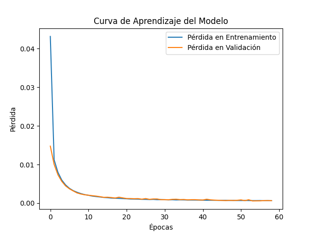
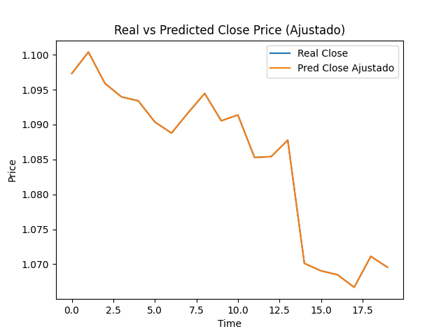

# Análisis de Datos Económicos y Financieros para Predecir el Tipo de Cambio EUR/USD

## Descripción del Proyecto

El objetivo principal de este proyecto es realizar un análisis exhaustivo de diversos indicadores económicos y financieros con el fin de predecir el tipo de cambio entre el euro (EUR) y el dólar estadounidense (USD). Para ello, se recopilan y procesan datos de diferentes fuentes que incluyen indicadores macroeconómicos de Estados Unidos y Europa, datos de mercado y otras variables relevantes. Estos datos se combinan en un único conjunto de datos, que luego se utilizará para desarrollar modelos de predicción y realizar análisis exploratorios.

## Componentes del Proyecto

### 1. Recopilación de Datos

#### Indicadores Macroeconómicos de Estados Unidos
- Producto Interno Bruto (PIB) trimestral.
- Decisiones de tasas de interés de la Reserva Federal.
- Índice de manufactura del ISM.
- Cambios en los inventarios de petróleo crudo.
- Cambio en el empleo no agrícola de ADP.
- Pedidos de bienes duraderos excluyendo transporte.
- Índice de confianza del consumidor.
- Permisos de construcción.
- Ventas de viviendas existentes y nuevas.

#### Indicadores Macroeconómicos de Europa y Alemania
- Cambio en el empleo de la Unión Europea.
- Índice de precios al productor (IPP) de Alemania.
- PIB trimestral de la Unión Europea y Alemania.
- Indicador de sentimiento económico ZEW de Alemania.
- Saldo comercial de España y la Unión Europea.
- Subastas de bonos a 10 años de Alemania.

#### Datos de Mercado
- Tipo de cambio diario EUR/USD.

### 2. Procesamiento de Datos
- **Cargar y Limpiar Datos:**
  - Los datos de los diferentes archivos CSV se cargan en DataFrames de Pandas.
  - Se procesan las columnas combinadas utilizando tabulaciones como separador.
  - Se formatean las fechas y se eliminan las columnas originales que contenían los datos sin procesar.
- **Combinar Conjuntos de Datos:**
  - Los diferentes DataFrames se combinan en uno solo utilizando la columna `Date` como clave.
  - Se rellenan los valores faltantes con los valores de las filas anteriores para asegurar la integridad de los datos.
  - Se eliminan las filas iniciales que contienen valores `NaN` en las columnas clave.

### 3. Análisis de Datos y Modelado
- **Análisis Exploratorio de Datos (EDA):**
  - Visualización de tendencias históricas y patrones en los datos combinados.
  - Análisis de correlación entre las variables económicas y el tipo de cambio EUR/USD.
- **Modelado Predictivo:**
  - Desarrollo de modelos de regresión, series temporales y aprendizaje automático para predecir el tipo de cambio EUR/USD.
  - Validación y evaluación de los modelos utilizando técnicas de validación cruzada y métricas de rendimiento.

### 4. Resultados y Visualización
- **Generación de Informes:**
  - Creación de informes detallados que resuman los hallazgos del análisis de datos.
  - Visualizaciones gráficas que ilustren las relaciones entre los indicadores económicos y el tipo de cambio.
    

- **Predicciones:**
  - Presentación de las predicciones del tipo de cambio EUR/USD basadas en los modelos desarrollados.
  - Análisis de escenarios y proyecciones futuras.
    

## Tecnología Utilizada
- **Python:** Para el procesamiento de datos, análisis y modelado predictivo.
- **Pandas:** Para la manipulación y análisis de datos.
- **Matplotlib y Seaborn:** Para la visualización de datos.
- **Scikit-learn:** Para el desarrollo de modelos predictivos.
- **Jupyter Notebooks:** Para la documentación y presentación del análisis y resultados.

## Impacto y Aplicaciones
El análisis y predicción del tipo de cambio EUR/USD tiene numerosas aplicaciones en el campo de las finanzas y la economía, incluyendo:
- **Empresas e Inversores:** Para tomar decisiones informadas sobre inversiones y estrategias de cobertura.
- **Analistas Financieros:** Para desarrollar informes y recomendaciones basadas en análisis de datos económicos.
- **Economistas y Políticos:** Para entender mejor los efectos de las políticas económicas y eventos macroeconómicos en el mercado de divisas.

Este proyecto proporciona una plataforma robusta para el análisis de datos económicos complejos y su aplicación en la predicción del tipo de cambio, lo que puede beneficiar a una amplia gama de interesados en los sectores financiero y económico.

